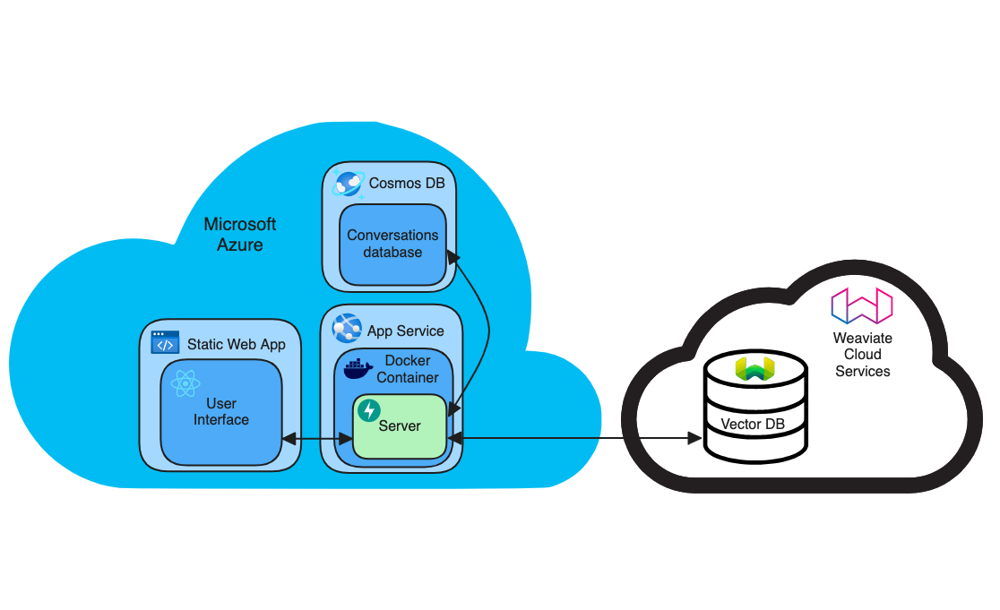
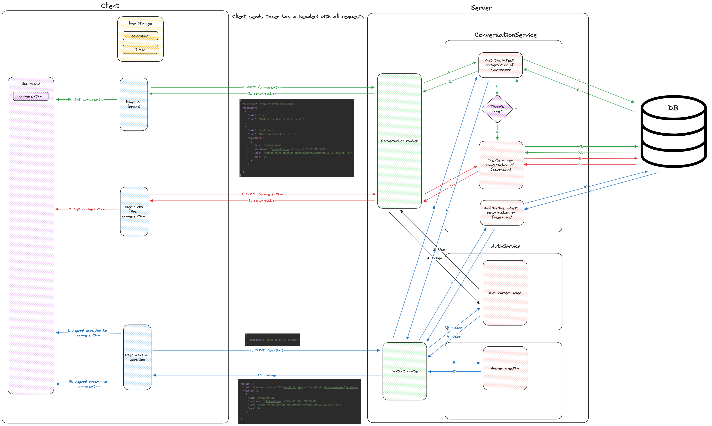

# Project structure, architecture and design

## Package management

This project uses [Poetry](https://python-poetry.org/) for package management.
It can be installed following the official [installation instructions](https://python-poetry.org/docs/#installation).
After it is installed, running `poetry install` in the project root will install all required dependencies according to the [`pyproject.toml`](../pyproject.toml) file.
Poetry creates a virtual environment for the project and installs all dependencies in it. This ensures that the project
dependencies are isolated from the system dependencies.

Here is a list of [common Poetry commands](../README.md#useful-poetry-commands).

Poetry is used also in the Dockerfile that is used for local development in Docker and for the production deployment.

## Framework

The server uses [FastAPI](https://fastapi.tiangolo.com/tutorial/) framework.

Endpoints are split by routers which are defined in the [`routers`](../ai_document_search_backend/routers) directory.
The main application is defined in [`application.py`](../ai_document_search_backend/application.py).
Each router defines its prefix. It also defines tags, which group router endpoints in the OpenAPI specification.
The routers are then added to the main application using the `include_router` function.

The endpoints define the request and response models. For non-primitive types, Pydantic models are used, for example:

```python
from pydantic import BaseModel


class ChatbotAnswer(BaseModel):
    text: str
    sources: list[Source]
```

FastAPI automatically validates the request data and returns the 422 status code if the request data is invalid.
It also validates the response data and returns the 500 status code if the response data is invalid.

Based on the request and response models, FastAPI automatically generates the OpenAPI specification which is available at https://ai-document-search-backend.azurewebsites.net/docs.

## Dependency injection

The code uses [dependency injection](https://python-dependency-injector.ets-labs.org/examples/fastapi.html) and is
tested using [pytest](https://docs.pytest.org/en/stable/).

Container

- config file
- e.g. swap cosmos database for in memory database

### local dev

Start Weaviate with `docker compose -f docker-compose-weaviate.yml up -d`.
Change URL in config

### Preprocessing scripts

### Observability scripts

### Mocking

### Authentication

The authentication is done using an OAuth2 password flow. The user sends their username and password to the `/token` endpoint. The endpoint returns a JWT token which is used to authenticate with the backend.

The token is stored in the local storage.
See the [`src/hooks/useAuth.tsx`](src/hooks/useAuth.tsx) file for more details.

The token is automatically sent in the `Authorization` header with every API call (see [`src/index.tsx`](src/index.tsx)).
### Error handling

FastAPI automatically handles unexpected application errors and returns the 500 status code.

A custom `ChatbotError` handler is defined in [`application.py`](../ai_document_search_backend/application.py) to handle exceptions related to answering questions, such as when there are too many tokens sent to OpenAI API.

## Testing

### Unit tests

Unit tests are defined in the [`tests`](../tests) directory.
They use the [`pytest`](https://docs.pytest.org/en/stable/) framework.

The [`tests`](../tests) directory structure mirrors the [`ai_document_search_backend`](../ai_document_search_backend) folder structure. The test files are named `test_<name_of_the_tested_file>.py`. The test functions are named `test_<name_of_the_tested_functionality>`.

The test files can contain multiple test functions. The test functions can contain multiple assertions. The assertions can use helpers from the [`anys`](https://github.com/jwodder/anys) library.

Not all files are tested directly. For example, services are tested through routers only.

The router tests use the `TestClient` from the `fastapi.testclient` module to simulate requests to the server.
They also ofter override various container dependencies with mock values.

Keep in mind that some tests use the real dependencies, e.g. a real Cosmos DB, and therefore require:

1. the service to be available,
2. the configration in [`config.yml`](../config.yml) to point to the service,
3. secret keys to be present as environment variables.

See the [key management](#key-management) section for more information about the secret keys.

A code coverage is measured for the unit tests. The ignored files are specified in [`.coveragerc`](../.coveragerc) file.
For more details, see the [CI/CD](#code-coverage) section.

### Load tests

Load testing of the server is done using [Locust](https://locust.io/).

The only focus is on the `/chatbot` endpoint, i.e. answering the user questions.
The tests are defined in [`locustfile.py`](../locustfile.py).
The tests fail if any of the requests returns a non-200 status code or if the average response time of the `/chatbot` endpoint is above 15 seconds.
If the average response time is above 5 seconds, the tests log a warning.
The tests require `AUTH_USERNAME` and `AUTH_PASSWORD` environment variables to be set.

The tests can be run either with the Locust UI or in the headless mode.

The headless mode is used in CI (see [`load_test.yml`](../.github/workflows/load_test.yml)).
It simulates 5 users using the application at the same time for 3 minutes.

See [`README.md`](../README.md#load-tests) for instructions on how to run the tests in UI mode.

## Key management

The secret keys are passed using environment variables. 

When running the server or tests locally, the secret keys are loaded from the `.env` file. The `.env` file is not committed to the repository.

When running the tests in GitHub Actions, the secret keys are loaded from the GitHub repository settings. See the `env` section of the GitHub Actions workflow.

The deployed application loads the secret keys from the Azure Web App configuration.

The keys needed for the full server functionality are:
- `APP_OPENAI_API_KEY`
- `APP_WEAVIATE_API_KEY`
- `COSMOS_KEY`
- `AUTH_SECRET_KEY`
- `AUTH_USERNAME`
- `AUTH_PASSWORD`

The keys needed for unit tests are:
- `APP_OPENAI_API_KEY`
- `APP_WEAVIATE_API_KEY`
- `COSMOS_KEY`

- The keys needed for load tests are:
- `AUTH_USERNAME`
- `AUTH_PASSWORD`

## Linting

The backend uses [Ruff](https://github.com/astral-sh/ruff) and [Black](https://github.com/psf/black) for linting and formatting.
The configuration for Ruff is located in the [`pyproject.toml`](../pyproject.toml) file in the `[tool.ruff]` section.
The configuration for Black is located in the [`black.py.toml`](../black.py.toml) file.

## CI/CD

### Linting and unit tests
On every push, GitHub Actions run linting and unit tests (see [`lint_and_test.yml`](../.github/workflows/lint_and_test.yml)).

### Code coverage
Code coverage is collected and added as a commit comment. If the overall code coverage is lower than 70%, the workflow fails.
On push to the `master` branch, the code coverage displayed in the project [`README.md`](../README.md) file is updated.

### Deployment
On every push to the `master` branch, GitHub Actions deploy the backend as an Azure Web App.
See [`master_ai-document-search-backend.yml`](../.github/workflows/master_ai-document-search-backend.yml).
There are no pull request preview deployments.

### Load tests
After the backend is deployed, GitHub Actions run load tests (see [`load_test.yml`](../.github/workflows/load_test.yml)).

## Deployment diagram



## Chatbot architecture


## Conversations saving


